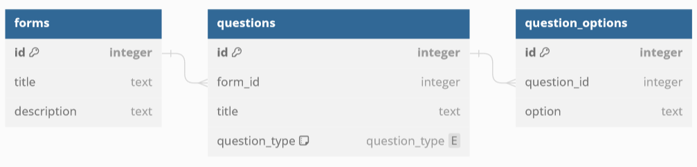

# CHAOS Technical Task

***Complete as many questions as you can.***

## Question 1
You have been given a skeleton function `process_data` in the `data.rs` file.
Complete the parameters and body of the function so that given a JSON request of the form

```json
{
  "data": ["Hello", 1, 5, "World", "!"]
}
```

the handler returns the following JSON:
```json
{
  "string_len": 11,
  "int_sum": 6
}
```

Edit the `DataResponse` and `DataRequest` structs as you need.

## Question 2

### a)
Write (Postgres) SQL `CREATE TABLE` statements to create the following schema.
Make sure to include foreign keys for the relationships that will `CASCADE` upon deletion.


**Answer box:**
```sql
CREATE TYPE question_type as ENUM ('MultiChoice', 'MultiSelect', 'ShortAnswer');

CREATE TABLE forms (
    id int,
    title varchar(255),
    description varchar(255)
);

CREATE TABLE questions (
  id int NOT NULL,
  form_id int NOT NULL,
  title varchar(255),
  question_type question_type NOT NULL,
  PRIMARY KEY (id),
  FOREIGN KEY (form_id) REFERENCES forms(id) ON DELETE CASCADE
);

CREATE TABLE question_options (
  id int NOT NULL,
  question_id int NOT NULL,
  option varchar(255),
  PRIMARY KEY (id),
  FOREIGN KEY (question_id) REFERENCES questions(id) ON DELETE CASCADE
);
```

### b)
Using the above schema, write a (Postgres) SQL `SELECT` query to return all questions in the following format, given the form id `26583`:
```
   id    |   form_id   |           title             |   question_type   |     options
------------------------------------------------------------------------------------------------------------
 2       | 26583       | What is your full name?     | ShortAnswer       | [null]
 3       | 26583       | What languages do you know? | MultiSelect       | {"Rust", "JavaScript", "Python"}
 7       | 26583       | What year are you in?       | MultiChoice       | {"1", "2", "3", "4", "5+"}
```

**Answer box:**
```sql
INSERT INTO forms (id)
VALUES (26583);

INSERT INTO forms (id)
VALUES (26584);

INSERT INTO questions (id, form_id, title, question_type)
VALUES (0, 26584, 'Test form do not fill', 'ShortAnswer');

INSERT INTO questions (id, form_id, title, question_type)
VALUES (2, 26583, 'What is your full name?', 'ShortAnswer');

INSERT INTO questions (id, form_id, title, question_type)
VALUES (3, 26583, 'What languages do you know?', 'MultiSelect');

INSERT INTO questions (id, form_id, title, question_type)
VALUES (7, 26583, 'What year are you in?', 'MultiChoice');

INSERT INTO question_options (id, question_id, option)
VALUES (0, 3, 'Rust');

INSERT INTO question_options (id, question_id, option)
VALUES (1, 3, 'JavaScript');

INSERT INTO question_options (id, question_id, option)
VALUES (2, 3, 'Python');

INSERT INTO question_options (id, question_id, option)
VALUES (3, 7, '1');

INSERT INTO question_options (id, question_id, option)
VALUES (4, 7, '2');

INSERT INTO question_options (id, question_id, option)
VALUES (5, 7, '3');

INSERT INTO question_options (id, question_id, option)
VALUES (6, 7, '4');

INSERT INTO question_options (id, question_id, option)
VALUES (7, 7, '5+');

SELECT 
  questions.id,
  questions.form_id,
  questions.title,
  questions.question_type,
  (SELECT array_agg(question_options.option) FROM question_options WHERE question_options.question_id = questions.id) AS options
FROM questions
WHERE questions.form_id = 26583;

```